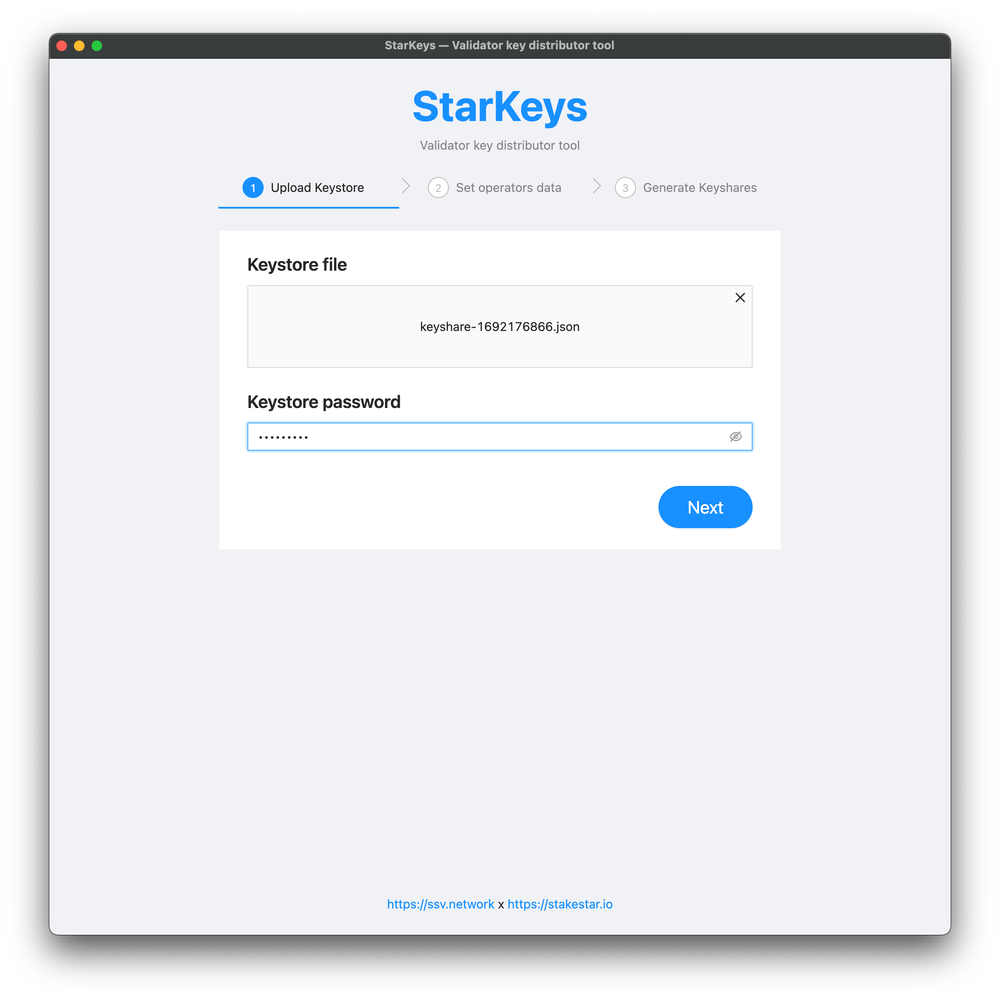
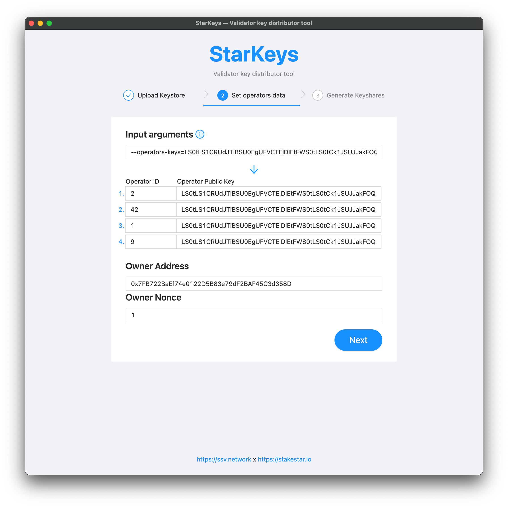
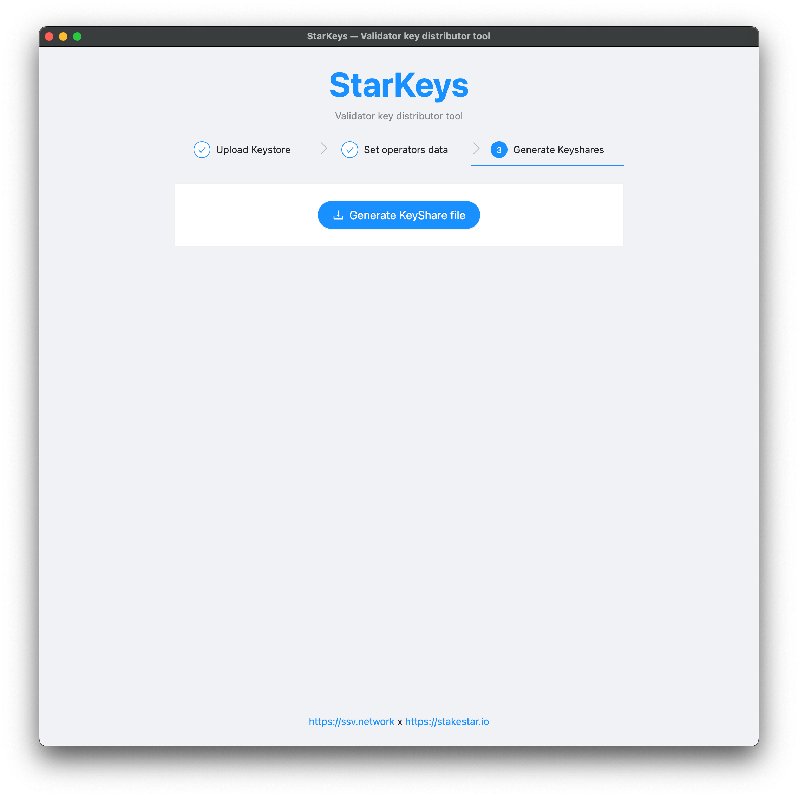

## StarKeys — SSV Validator key distributor tool

Electron based GUI util for key distribution for [ssv.network](https://ssv.network). Developed around [ssv-keys](https://github.com/bloxapp/ssv-keys) library.

Fully offline alternative to the ssv-cli.

Download the latest version on [release section](https://github.com/onestaree/ssv-key-distributor-app/releases).

## Screenshots

## Developent

- `yarn` - Install dependencies
- `yarn start` - Run the app in dev mode

On mac:
`Option + Command + I` - Open DevTools panel

## License

MIT License
